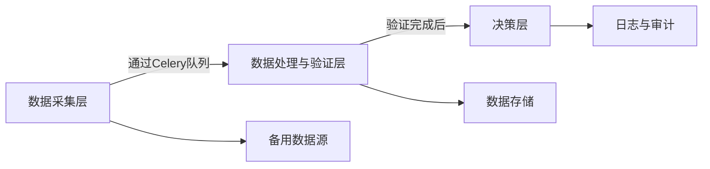

# 🐍 Python 🛠️ 稳定决策系统架构设计

在构建一个基于 🐍 的稳定决策系统时，我们面临以下几个典型的挑战：

### 😵 挑战一：数据来源不稳定

数据来源的波动性 📊 和不稳定性会影响数据的准确性 🎯 和完整性 📝，导致系统难以保持稳定。

### 🔄 挑战二：数据结构的动态变化

不同数据来源可能具有不一致的数据结构 🏗️，且这种结构可能随时间 ⏳ 变化，要求系统具备足够的灵活性 🌀 来适应这些变化。

### 🔧 挑战三：需要实时调整的决策逻辑

业务需求可能频繁变化 ⚡，要求系统能够根据新数据 📊 动态调整决策逻辑 🛠️，而不影响系统的正常运行。

这些挑战极大地影响了系统的稳定性 🚧。然而，决策系统本身又必须具备稳定的行为，保证关键业务不受到波动的影响。因此，本文将为此类系统提供一种架构设计思路 🏗️，以帮助解决这些问题，并确保系统的高效性 🚀 和稳定性 🛡️。

## 🏗️ 系统架构概述

系统整体分为三个主要的层次：**数据采集层、数据处理与验证层、决策层**，各层通过 Celery 任务队列 📥 和消息代理 📡 进行通信，确保数据在每一步的有序流动和处理。

下图展示了整个系统的架构和数据流动方式：

### 🐍 1. 数据采集层（爬虫层）

数据采集层负责从多个数据源获取实时数据 ⏱️。由于数据源的波动和网络的不稳定性 🌐，这一层必须具备容错能力 🛠️，并且可以灵活地应对变化。以下是具体设计思路：

#### 🧩 模块化爬虫设计

- 使用**微服务架构**，为每个数据来源创建单独的爬虫微服务 🐛。每个爬虫独立运行，确保某个爬虫失效时不影响其他服务的正常工作。
- 使用**Celery**来管理任务队列，将采集的数据推送到下一层，保证数据的有序处理，并有效应对高并发和数据来源不稳定的情况。Celery 可以借助 Redis 或 RabbitMQ 作为消息代理 📡，确保任务的高效调度。在采集完成后，爬虫微服务会将数据推送到 Celery 队列中，以通知数据处理层。

#### 🛠️ 容错机制和重试策略

- 使用**超时控制** ⏳ 和**重试机制** 🔄，在遇到网络波动或数据源短暂不可用时，多次尝试以提高获取成功率。
- 捕获异常并记录错误日志 📋，以便后续跟踪和修复故障。

#### 🩺 数据源健康检查

- 周期性健康检查自动识别不可用的数据源 🚫，暂时停止向其请求数据，节省系统资源。
- 实现**备用数据源机制**，在主要数据源失效时快速切换到备用数据源 🔄，确保数据采集的连续性。

#### 📊 信号持久化和重复数据去重

- **信号持久化**：采集到的重要信号需要进行持久化处理，确保即使在系统重启或故障时，信号不会丢失。可以使用数据库（如 PostgreSQL）来存储信号的详细信息（如时间戳 ⏱️、来源、类型）。
- **Redis 去重机制**：使用 Redis 的 `SADD` 命令将信号标识符存储在 Set 中，以便新数据到来时快速判断是否为重复数据，防止重复处理。
- **唯一标识符（ID）去重**：对每条数据生成唯一标识符（如交易哈希值或 Tweet ID），通过数据库检查这些标识符是否已存在，避免重复处理相同的数据。

### 🛠️ 2. 数据处理与验证层

在数据采集之后，下一步是对数据进行处理和验证 ✅。由于不同数据源的数据结构可能不同，数据处理层需要具备灵活的数据标准化能力。

#### 🚦 数据缓冲与预处理

- 通过**Celery**与**Redis**作为消息代理和结果存储，数据处理与验证层从 Celery 队列中提取数据进行处理。这可以缓解数据采集层与数据处理层之间的压力，确保即使在高峰期也能有效处理，同时支持任务的分布式处理。
- 在缓冲区中对数据进行**去重、排序和聚合**，保证数据的一致性和完整性。

#### 📐 数据标准化与格式转换

- 使用**数据处理模块**来动态适配不同来源的数据格式，可以利用**JSON Schema**或**Pydantic**来定义数据模型，确保数据的一致性和正确性。
- 对于动态变化的数据结构，建议使用**可选字段与版本控制**来保证数据的兼容性，避免数据格式变化导致系统崩溃 💥。

#### 📊 数据质量评估

- 使用数据质量检查工具（如检测缺失值、异常值等），严格把关输入数据，确保数据质量达到标准后再进入决策层。
- 根据不同数据源的质量设置**质量评分** ⭐，当数据源质量不高时，将其影响降到最低，确保决策的准确性。

### 💡 3. 决策层

决策层是整个系统的核心部分 💛，负责根据输入数据做出相应的决策 🎯。考虑到业务需求的不断变化，决策层需要具备动态调整的能力。

#### ⚙️ 规则引擎与模型服务

- 采用**Python 自定义规则系统** 🐍，通过简单的 `if-else` 逻辑来定义和管理决策逻辑，保持代码清晰易懂，同时保证灵活性。
- 结合**机器学习模型** 🧠 辅助决策，通过 Python 编写灵活的决策逻辑，根据模型结果进行动态调整，适应不断变化的市场情况 📈。

#### 🔄 动态决策和配置中心

- 使用**简单的配置文件**（如 YAML 或 JSON）来存储可配置的决策参数 📝，方便动态调整。这样可以快速改变决策策略，而无需重启服务，减少系统的复杂性。
- 决策逻辑通过 REST API 🌐 对外提供服务，保证灵活性和可访问性，使业务逻辑的更新变得非常方便。

#### 📝 日志与审计

- 对每次决策过程进行**日志记录** 📋，保存输入数据、决策结果以及规则和模型的版本信息，以便追踪和分析每次决策。
- **审计日志**使每个决策的产生过程透明可查 🔍，便于排查问题和评估系统性能。

### 🧰 4. 技术选型与工具推荐

#### 🐛 爬虫层

- 使用**Scrapy**或**Selenium**进行数据采集，结合**Celery**管理爬虫任务，Celery 能够对任务进行调度、重试和容错，便于任务的稳定执行和控制，尤其适用于需要高并发的爬虫任务。
- 使用**Docker** 🐳 对爬虫微服务进行容器化，便于管理和扩展。

#### 📥 队列系统

- 使用**Celery**来实现数据异步通信和任务调度，保证爬虫层与数据处理层之间的解耦。Celery 提供了简单的接口来处理异步任务，适用于复杂工作流的管理。

#### 📊 数据处理与验证

- 使用**Pandas** 🐼 进行数据的标准化处理，结合**Pydantic**进行数据验证。
- 数据存储使用**PostgreSQL** 🐘（结构化数据）来存储所有重要数据，以及**Redis**（缓存处理）以提高访问效率。

#### 💡 决策层

- 采用**Python 自定义逻辑** 🐍 来编写规则和条件，在简单场景中直接在 Python 脚本中加载机器学习模型 🧠，避免引入额外的服务化步骤，进一步简化系统。如果有较高的并发需求，再考虑将模型打包为服务。
- 使用 Python 内置的 `logging` 库对系统运行情况进行简单监控 🖥️，配合 `RotatingFileHandler` 实现日志轮替，减少系统复杂性。在需要更强大的监控功能时，再考虑引入 Prometheus 和 Grafana 📊。

### 💻 编程范式建议

在代码编写方面，建议结合**面向对象编程** 🏗️、**函数式编程** ➕ 和**结构化编程** 📜 的方式进行开发。通过面向对象编程来封装数据采集和决策模块，通过函数式编程来处理数据流的变换与验证，并在简单的任务调度中使用结构化编程，以保持代码的简洁性和高效性。

## 🖼️推荐书籍

### 1. 《微服务架构设计模式》 - Chris Richardson

这本书详细介绍了微服务架构的基本概念和设计模式，帮助理解如何分解系统功能并实现服务之间的松耦合。对于构建爬虫微服务以及确保系统的可维护性和扩展性，这本书非常有帮助。

### 2. 《分布式系统：概念与设计》 - George Coulouris

该书对于理解分布式系统的基础知识和通信机制非常有帮助。它将使你更好地理解如何在数据采集层和数据处理层之间进行异步通信和任务管理。

### 3. 《Python 编程实践：设计高效、稳定、可维护的应用》 - Luciano Ramalho

本书对 Python 语言在系统设计中的应用提供了深度的探讨。书中涵盖了面向对象编程、函数式编程等理念，可以帮助你在开发决策系统时保持代码的清晰和高效。

### 4. 《Celery 异步任务框架入门与实战》

对于掌握 Celery 的基础和高级功能，本书提供了许多实践例子和项目，帮助你高效实现任务调度、重试和错误处理，是构建异步数据采集与处理的重要参考。

### 5. 《高可用架构》 - 龚磊

该书针对如何设计高可用系统进行了深入的分析，特别适合在面对不稳定的数据来源和变化的数据结构时确保系统稳定性的场景。

### 6. 《Python 数据科学手册》 - Jake VanderPlas

这本书对于使用 Pandas 进行数据处理与标准化提供了详细的教程，是数据处理与验证层不可或缺的参考书籍。

### 7. 《日志驱动架构》 - Sam Newman

为了更好地监控和审计系统运行情况，这本书提供了关于日志系统设计的最佳实践，能够帮助你实现可靠的日志与审计机制。

### ✅ 结论

本文提供的架构设计旨在通过模块化、解耦合的方式来提升整个系统的灵活性和稳定性 🛡️。数据采集、处理和决策各层独立设计与管理，减少相互依赖的耦合度，使系统在面对数据源波动和决策规则变化时依然保持稳健运行 💪。通过合理的技术选型与设计模式，可以有效应对当前和未来的业务需求，保证系统的长期稳定和高效 🚀。
